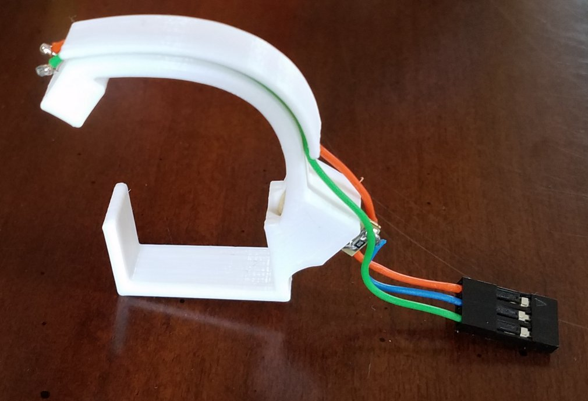

# Ball Detector

## Parts

- Bracket (designed with Fusion 360) http://a360.co/2oVDeuF
- Laser Diode https://www.amazon.com/gp/product/B01ITK4PEO
- Photoresistor https://www.amazon.com/gp/product/B016D737Y4

## Circuit

## Software Library

https://github.com/spark/library-beam-detector

## Assembly

- 3d print the bracket. If the laser diode is too loose or tight in the hole,
  tweak the diameter in Fusion 360 and print again.
- Insert the photoresistor. I like cutting one leg shorter than the
other so I can insert them one at at time in the tiny holes.
- Insert the laser diode loosely.
- Connect a multimeter to the photoresistor in resistance measurement mode.
- Connect a power supply (3.3V or 5V) to the laser diode. Blue is ground, red is positive.
- Rotate the laser diode in the hole to get the smallest resistance measurement on the photoresistor.
- Press the laser diode firmly in.
- Solder some wires to the photoresistor wires and shove the wires inside the channel.
- Unsolder the laser diode wires and solder some sturdier wires.
